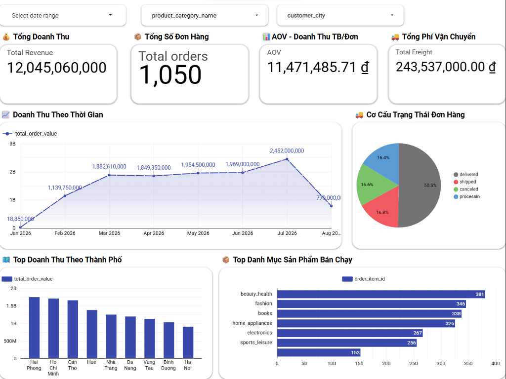
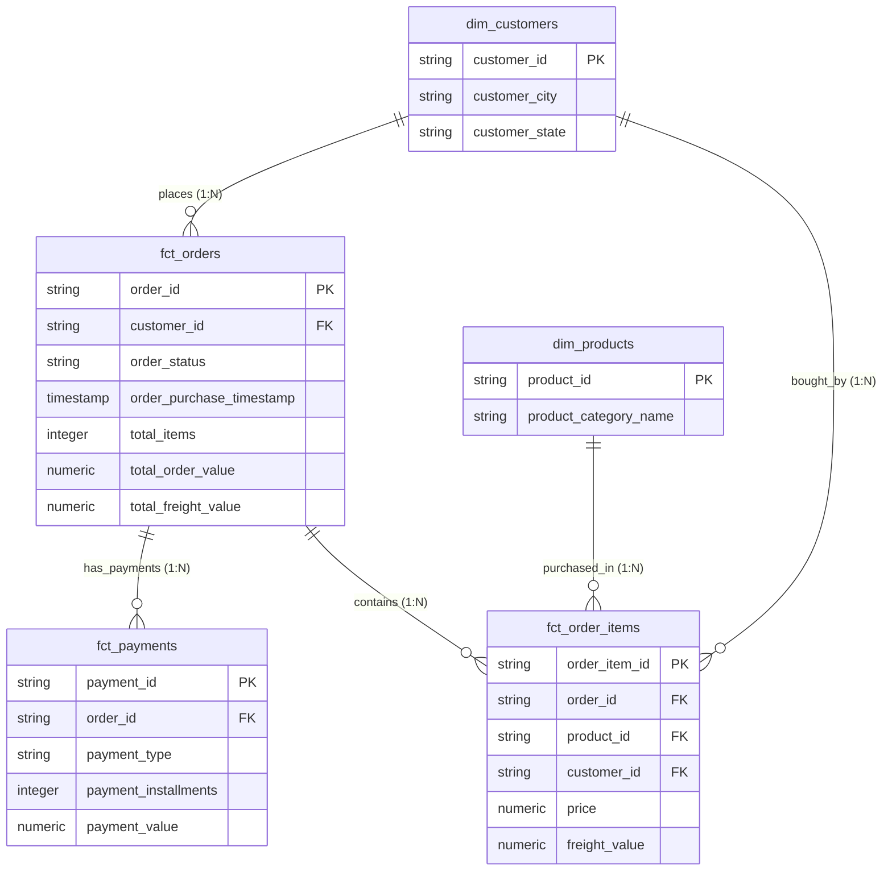

# Automated Enterprise ELT Data Platform (GCP & Prefect Cloud)

[](https://www.python.org/)
[](https://cloud.google.com/)
[](https://www.getdbt.com/)
[](https://www.prefect.io/)
[](https://github.com/features/actions)
[](https://datastudio.google.com/reporting/7d592d8e-bc9e-464f-adeb-008de9c7b35f)

An end-to-end, production-grade **Modular Multi-Connector ELT (Extract - Load - Transform)** Data Platform built for modern enterprise analytics. Designed with a **Plugin Monorepo Architecture**, the platform standardizes data contracts across ingestion sources, loads compressed columnar Parquet files into Google Cloud Storage (GCS) Data Lake, synchronizes to BigQuery Staging, and transforms data into an **OLAP Star Schema and One Big Table (OBT) Analytics View** using `dbt-bigquery` with automated Data Quality testing. Fully orchestrated with Prefect Cloud and automated 24/7 on GitHub Actions with real-time Telegram alerts.

---

## Architecture Diagram


---

## Key Highlights & Enterprise Architecture

- **Modular Multi-Connector Monorepo (`connectors/`):** Plug-and-play ingestion layer inheriting from `BaseConnector` abstract base class with standardized `RunArgs` contract (`INCREMENTAL` & `FULL_REFRESH` modes).
- **CLI Scaffolding Tool (`cli/create_connector.py`):** Instantly scaffold new data connectors with boilerplate ingestion logic and dbt staging sources in seconds:
  ```bash
  python cli/create_connector.py --name <connector_name>
  ```
- **Enterprise-Grade dbt Layer (`dbt/`):** Root-level dbt structure organized by source domain (`models/staging/<source>/`) and enterprise marts (`models/marts/`).
- **Incremental Merge Strategy & FinOps:** Configured `materialized='incremental'` with `merge` strategy, 3-day lookback window, day-level partitioning on `order_purchase_timestamp`, and clustering on `[order_status, customer_id]` for BigQuery query cost optimization.
- **Automated Data Quality Framework:** 17 automated tests (16 schema tests + custom singular test asserting non-negative order values) enforcing 100% data integrity before BI consumption.
- **24/7 Cloud Orchestration & Alerting:** Automated execution on GitHub Actions every 2 hours with Prefect Cloud observability and rich Telegram Bot status alerts with direct execution log links.

---

## Tech Stack

- **Orchestration:** Prefect Cloud, GitHub Actions (24/7 Cloud Automation)
- **Ingestion & Ingestion Framework:** Python 3.11+, Pydantic (`connectors/`)
- **Data Lake (Landing Zone):** Google Cloud Storage (GCS)
- **Data Warehouse:** Google BigQuery (staging and marts datasets)
- **Transform & Testing Engine:** dbt-bigquery (Root Level `dbt/`)
- **BI & Analytics:** Google Looker Studio
- **Notifications & Alerting:** Telegram Bot Instant Notifications

---

## Interactive Looker Studio Dashboard

The project includes an executive performance dashboard on Google Looker Studio connected directly to BigQuery View `marts.wide_orders_analytics`:



- **Live Interactive Dashboard:** [View on Looker Studio](https://datastudio.google.com/reporting/7d592d8e-bc9e-464f-adeb-008de9c7b35f)
- **Key Performance Indicators:** Total Revenue, Total Orders, Average Order Value (AOV), Total Freight Value.
- **Analytics Visualizations:** Revenue trend over time, Regional sales distribution by city/state, Top 5 best-selling product categories, Order status and payment breakdown.

---

## Data Warehouse Schema (OLAP Star Schema)

The dimensional data warehouse model is structured into `staging` and `marts` datasets in Google BigQuery, with transformations managed by `dbt-bigquery`:



### Data Marts Models:
- **`marts.dim_customers`**: Customer geographic profile (`customer_id`, `customer_city`, `customer_state`).
- **`marts.dim_products`**: Product catalog information (`product_id`, `product_category_name`).
- **`marts.fct_orders`**: Order-level aggregations (`order_id`, `customer_id`, `total_items`, `total_order_value`, `total_freight_value`) with day-partitioning and clustering.
- **`marts.fct_order_items`**: Line-item granularity fact table (`order_item_id`, `order_id`, `product_id`, `price`, `freight_value`).
- **`marts.fct_payments`**: Payment transaction methods and values (`payment_id`, `order_id`, `payment_type`, `payment_value`).
- **`marts.wide_orders_analytics`**: Pre-joined One Big Table (OBT) View for direct BI consumption without manual table blending.

---

## Quick Start & CLI Usage

### 1. Run Pipeline for Default / Target Connector
```bash
# Run incremental pipeline for PostgreSQL connector
python main.py --connector postgres_db

# Run historical backfill by date range
python main.py --connector postgres_db --start-date 2026-05-01 --end-date 2026-05-31

# Force full-refresh rebuild of marts
python main.py --full-refresh
```

### 2. Scaffold a New Data Connector
```bash
python cli/create_connector.py --name shopify_api
```

### 3. Run dbt Transformations and Data Quality Tests
```bash
# Run via platform runner
python -m src.transform.run_transform

# Or run directly via dbt CLI
dbt run --project-dir dbt --profiles-dir dbt
dbt test --project-dir dbt --profiles-dir dbt
```