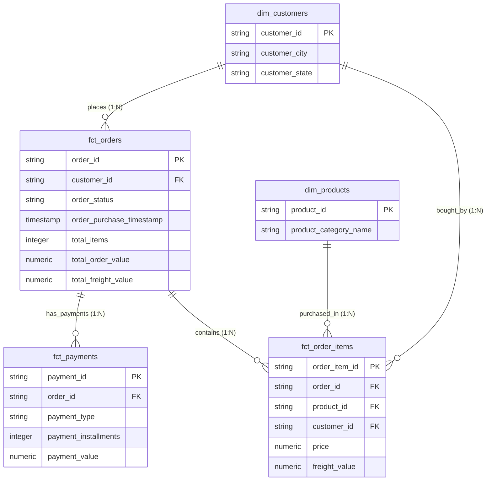

# Automated E-Commerce ELT Data Pipeline (GCP & Prefect Cloud)

An end-to-end, production-ready Cloud-Native **ELT (Extract – Load – Transform)** Data Pipeline built for E-Commerce analytics. Data is extracted from a PostgreSQL database, stored as compressed columnar Parquet files in Google Cloud Storage (GCS), loaded into BigQuery Staging, and modeled into an **OLAP Star Schema and One Big Table (OBT) Analytics View** using `dbt-bigquery` for business intelligence on **Google Looker Studio**. Orchestrated with Prefect Cloud and automated 24/7 on GitHub Actions with real-time Telegram alerts.

---

## Architecture Diagram

---

## Tech Stack

- **Orchestration:** Prefect Cloud, GitHub Actions (24/7 Cloud Automation)
- **Data Lake (Landing Zone):** Google Cloud Storage
- **Data Warehouse:** Google BigQuery (staging and marts datasets)
- **Transform Engine:** dbt-bigquery (Star Schema & OBT Analytics View)
- **BI & Analytics:** Google Looker Studio
- **Notifications & Alerts:** Telegram Bot Instant Notifications

---

## Interactive Looker Studio Dashboard

The project includes an executive performance dashboard on Google Looker Studio connected directly to BigQuery View `marts.wide_orders_analytics`:

- **Live Interactive Dashboard:** [View on Looker Studio](https://datastudio.google.com/reporting/7d592d8e-bc9e-464f-adeb-008de9c7b35f)
- **Key Performance Indicators:** Total Revenue, Total Orders, Average Order Value (AOV), Total Freight Value.
- **Analytics Visualizations:** Revenue trend over time, Regional sales distribution by city/state, Top 5 best-selling product categories, Order status and payment breakdown.

---

## Data Warehouse Schema (OLAP Star Schema)

The dimensional data warehouse model is structured into `staging` and `marts` datasets in Google BigQuery, with transformations managed by `dbt-bigquery`:

### Data Marts Models:
- **`marts.dim_customers`**: Customer geographic profile (`customer_id`, `customer_city`, `customer_state`).
- **`marts.dim_products`**: Product catalog information (`product_id`, `product_category_name`).
- **`marts.fct_orders`**: Order-level aggregations (`order_id`, `customer_id`, `total_items`, `total_order_value`, `total_freight_value`).
- **`marts.fct_order_items`**: Line-item granularity fact table (`order_item_id`, `order_id`, `product_id`, `price`, `freight_value`).
- **`marts.fct_payments`**: Payment transaction methods and values (`payment_id`, `order_id`, `payment_type`, `payment_value`).
- **`marts.wide_orders_analytics`**: Pre-joined One Big Table (OBT) View for direct BI consumption without manual table blending.

---

## Key Features

- **Modern Orchestration:** Prefect 3.x with automated retry policies, task dependency tracking (`wait_for`), and cloud logging.
- **24/7 Cloud Execution:** Automated scheduled pipeline execution on GitHub Actions cloud runners.
- **Real-Time Alerting:** Instant Telegram Bot notifications on pipeline execution status with run metrics.
- **Zero-Blending BI Experience:** BigQuery View `wide_orders_analytics` enables instant drag-and-drop analytics in Looker Studio without complex multi-table joins.