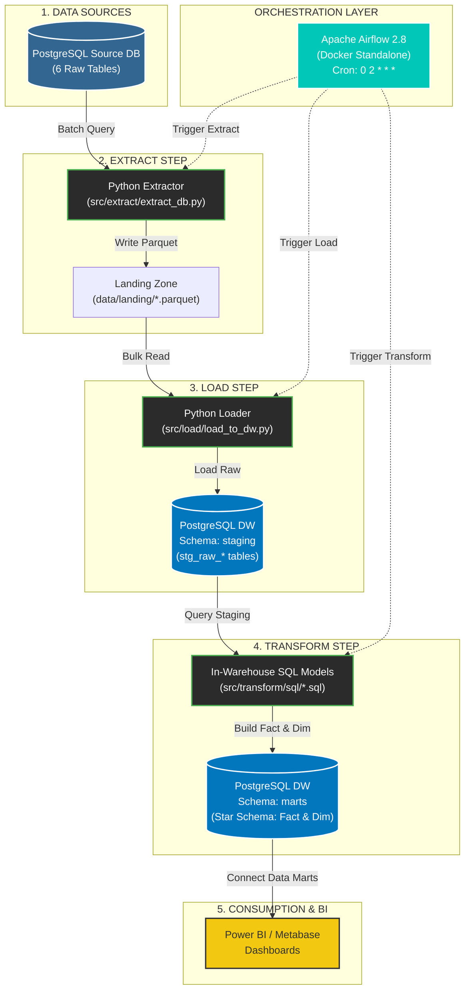

# 🚀 Automated E-Commerce ELT Data Pipeline & Data Warehouse

[](https://www.python.org/)
[](https://www.postgresql.org/)
[](https://airflow.apache.org/)
[](https://www.docker.com/)
[](LICENSE)

An end-to-end, production-ready **ELT (Extract – Load – Transform)** Data Pipeline built for E-Commerce analytics. Dữ liệu được rút trích tự động từ PostgreSQL Server nguồn, lưu trữ dạng Parquet tại Landing Zone, nạp vào Data Warehouse Staging schema, và chuyển đổi thành mô hình **Star Schema (Fact & Dimension Tables)** phục vụ báo cáo Business Intelligence (Power BI, Metabase, Tableau).

---

## 📌 Table of Contents
- [Architecture Diagram](#-architecture-diagram)
- [Tech Stack](#-tech-stack)
- [Project Directory Structure](#-project-directory-structure)
- [Key Features](#-key-features)
- [Data Warehouse Schema (Star Schema)](#-data-warehouse-schema-star-schema)
- [Quick Start & Setup Guide](#-quick-start--setup-guide)
  - [1. Prerequisites](#1-prerequisites)
  - [2. Environment Configuration](#2-environment-configuration)
  - [3. Running Pipeline via Terminal](#3-running-pipeline-via-terminal)
  - [4. Running Pipeline via Apache Airflow (Docker)](#4-running-pipeline-via-apache-airflow-docker)
  - [5. Inspecting Data Warehouse Tables](#5-inspecting-data-warehouse-tables)
- [Author & License](#-author--license)

---

## 📐 Architecture Diagram

Pipeline tuân thủ nghiêm ngặt mô hình kiến trúc **ELT (Extract – Load – Transform)** với sự điều phối tự động bởi **Apache Airflow**:



---

## 🛠 Tech Stack

- **Orchestration:** Apache Airflow 2.8.1, Docker, Docker Compose
- **Database / Data Warehouse:** PostgreSQL Cloud Server, Apache Parquet
- **Language & Core Libraries:** Python 3.10+, Pandas, PyArrow, SQLAlchemy, psycopg2-binary, python-dotenv
- **Data Modeling:** Native In-Warehouse SQL, dbt (data build tool) ready
- **Logging & Monitoring:** Custom ANSI Colored Terminal Logger

---

## 🌳 Project Directory Structure

```text
.
├── README.md                           # Documentation & Setup Guide
├── PROJECT_STRUCTURE.md                # Detailed project architecture description
├── requirements.txt                    # Python dependencies
├── .env                                # Database credentials & environment variables
├── .gitignore                          # Git ignore configuration
├── docker-compose.yml                  # Docker setup for Apache Airflow WebUI & Scheduler
├── main.py                             # CLI entry point to run full end-to-end ELT pipeline
├── view_dw_tables.py                   # Data Warehouse CLI inspector script
├── dags/                               # Airflow DAGs folder
│   └── elt_pipeline_dag.py             # Airflow DAG defining Extract -> Load -> Transform workflow
├── src/                                # Source code for ELT pipeline
│   ├── extract/                        # Data extraction modules
│   │   ├── extract_api.py
│   │   ├── extract_db.py               # Batch Postgres table extraction to Parquet
│   │   └── extract_stream.py
│   ├── load/                           # Raw data loading modules
│   │   ├── load_to_lake.py
│   │   └── load_to_dw.py               # Bulk loading Parquet files into DW staging schema
│   ├── transform/                      # In-Warehouse SQL transformation models
│   │   ├── dbt/                        # dbt project structure
│   │   ├── sql/                        # SQL Transformation scripts
│   │   │   ├── dim_customers.sql       # Customer Dimension table
│   │   │   ├── dim_products.sql        # Product Dimension table
│   │   │   ├── fct_orders.sql          # Order Fact table (aggregations & joins)
│   │   │   └── fct_payments.sql        # Payment Fact table
│   │   └── run_transform.py            # Transformation runner
│   └── utils/                          # Shared utilities
│       ├── config.py                   # Environment configuration loader
│       ├── db_connector.py             # SQLAlchemy Engine manager
│       └── logger.py                   # Custom ANSI colored logger
├── tests/                              # Automated tests (Unit & Data Quality)
├── data/                               # Local landing storage
│   └── landing/                        # Raw Parquet landing directory
├── notebooks/                          # Jupyter Notebooks for EDA & Data Profiling
└── logs/                               # Pipeline execution logs
```

---

## ✨ Key Features

- **Batch Multi-Table Extraction:** Tự động trích xuất hàng loạt 6 bảng dữ liệu liên quan.
- **Automated Deduplication:** Tự động dọn dẹp Landing Zone trước mỗi lượt chạy, ngăn ngừa tích tụ file trùng lặp.
- **Version-Safe Database Transactions:** Sử dụng `engine.begin()` của SQLAlchemy đảm bảo chạy ổn định trên cả SQLAlchemy 1.4.x (Airflow) và 2.0.x.
- **Airflow Web UI Orchestration:** Lập lịch tự động chạy lúc **02:00 AM** hàng ngày với giao diện trực quan tại `http://localhost:8080`.
- **Colored Terminal Logging:** Custom logger hiển thị màu sắc trực quan (Cyan for time, Green for INFO, Red for ERROR).

---

## 📊 Data Warehouse Schema (Star Schema)

### Schema: `staging` (Raw Loaded Data)
- `staging.stg_raw_customers`
- `staging.stg_raw_orders`
- `staging.stg_raw_order_items`
- `staging.stg_raw_payments`
- `staging.stg_raw_products`
- `staging.stg_raw_reviews`

### Schema: `marts` (Business Analytics & BI Ready)
- **`marts.dim_customers`**: Chuẩn hóa thông tin địa lý khách hàng (`customer_id`, `customer_city`, `customer_state`).
- **`marts.dim_products`**: Quản lý thông tin danh mục sản phẩm (`product_id`, `product_category_name`).
- **`marts.fct_orders`**: Tổng hợp thông tin đơn hàng, tổng doanh thu và cước vận chuyển (`order_id`, `customer_id`, `total_items`, `total_order_value`, `total_freight_value`,...).
- **`marts.fct_payments`**: Phân tích phương thức và giá trị thanh toán (`payment_id`, `order_id`, `payment_type`, `payment_value`,...).

---

## 🚀 Quick Start & Setup Guide

### 1. Prerequisites
- Python 3.10 or higher
- Docker Desktop (for Airflow WebUI)
- Access to a PostgreSQL instance

### 2. Environment Configuration
Tạo hoặc cập nhật tệp `.env` tại thư mục gốc của dự án:

```env
DB_HOST=your_postgres_host
DB_PORT=5432
DB_NAME=your_database_name
DB_USER=your_username
DB_PASSWORD=your_password
DB_SCHEMA=public

LANDING_DIR=data/landing
```

Cài đặt các thư viện Python:
```bash
pip install -r requirements.txt
```

### 3. Running Pipeline via Terminal
Kích hoạt toàn bộ luồng ELT trực tiếp từ Terminal:

```bash
python main.py
```

### 4. Running Pipeline via Apache Airflow (Docker)
Khởi chạy Airflow Web UI bằng Docker Compose:

```bash
docker compose up -d
```

1. Mở trình duyệt và truy cập: **`http://localhost:8080`**
2. Đăng nhập với tài khoản:
   - **Username:** `admin`
   - **Password:** `admin` (hoặc lấy trong tệp `standalone_admin_password.txt`)
3. Bật công tắc Unpause DAG `elt_ecommerce_pipeline` và bấm **Play ▶️** để xem biểu đồ chạy tự động.

### 5. Inspecting Data Warehouse Tables
Chạy script tra cứu số lượng bản ghi và xem thử nội dung dữ liệu trong các bảng Data Marts:

```bash
python view_dw_tables.py
```

---

## 📜 Author & License

Developed with ❤️ as a modern Data Engineering Portfolio Project.
Distributed under the **MIT License**.
