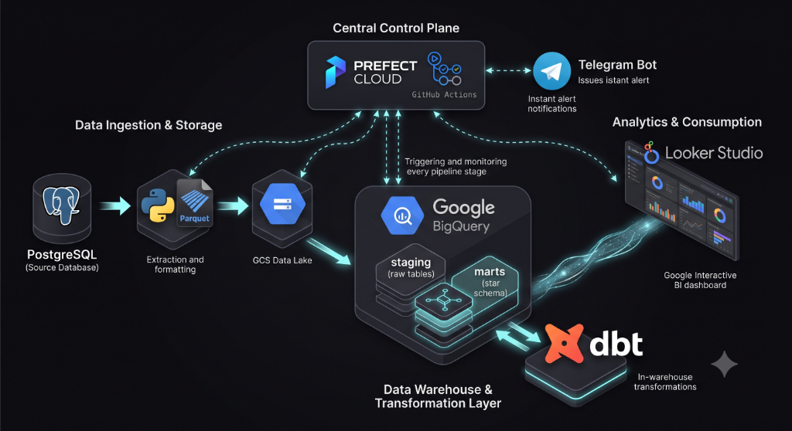

# 🚀 Automated E-Commerce ELT Data Pipeline (Prefect & Cloud Native)

[](https://www.python.org/)
[](https://cloud.google.com/)
[](https://www.getdbt.com/)
[](https://www.prefect.io/)
[](https://github.com/features/actions)
[](https://datastudio.google.com/reporting/7d592d8e-bc9e-464f-adeb-008de9c7b35f)
[](LICENSE)

An end-to-end, modern **GCP Cloud Native ELT (Extract – Load – Transform)** Data Pipeline built for E-Commerce analytics orchestrated by **Prefect**. Dữ liệu được rút trích tự động từ PostgreSQL Source DB, lưu trữ tại GCS Data Lake, nạp vào BigQuery Staging, và chuyển đổi thành mô hình **Star Schema & One Big Table View** bởi `dbt-bigquery` phục vụ báo cáo Business Intelligence trên **Google Looker Studio**.

---

## 📌 Table of Contents
- [Architecture Diagram](#-architecture-diagram)
- [Tech Stack](#-tech-stack)
- [Interactive Looker Studio Dashboard](#-interactive-looker-studio-dashboard)
- [Project Directory Structure](#-project-directory-structure)
- [Key Features](#-key-features)
- [Data Warehouse Schema (Star Schema)](#-data-warehouse-schema-star-schema)
- [Quick Start & Setup Guide](#-quick-start--setup-guide)
- [Author & License](#-author--license)

---



---

## 🛠 Tech Stack

- **Orchestration:** Prefect 3.x / Cloud, GitHub Actions (24/7 Cloud Automation)
- **Data Lake (Landing Zone):** Google Cloud Storage (GCS Bucket `gs://ecommerce-data-lake-504901/`)
- **Data Warehouse:** Google BigQuery (`staging` and `marts` datasets)
- **Transform Engine:** `dbt-bigquery` (Star Schema & OBT Analytics View)
- **Language & Core SDKs:** Python 3.11, Pandas, PyArrow, SQLAlchemy 2.0+, google-cloud-storage, google-cloud-bigquery
- **BI & Analytics:** Google Looker Studio
- **Notifications & Alerts:** Telegram Bot Instant Notifications

---

## 📊 Interactive Looker Studio Dashboard

Project bao gồm trang báo cáo **E-Commerce Executive Performance Dashboard** trên Google Looker Studio kết nối trực tiếp với BigQuery View `marts.wide_orders_analytics`:

👉 **[🔗 Click vào đây để mở Báo cáo Tương Tác Trực Tiếp (Live Looker Studio Dashboard)](https://datastudio.google.com/reporting/7d592d8e-bc9e-464f-adeb-008de9c7b35f)**

- **Top KPI Cards:** Total Revenue, Total Orders, Average Order Value (AOV), Total Freight.
- **Revenue Trend:** Xu hướng doanh thu & đơn hàng theo thời gian.
- **Regional Sales:** Phân bố doanh số theo Bang / Tỉnh thành.
- **Product Category:** Top 5 danh mục sản phẩm bán chạy nhất.
- **Payment Method:** Phân tích tỷ trọng các phương thức thanh toán.

---

## 🌳 Project Directory Structure

```text
.
├── README.md                           # Documentation & Setup Guide
├── PROJECT_STRUCTURE.md                # Detailed project architecture description
├── requirements.txt                    # Python dependencies (Prefect, dbt-bigquery, GCP SDKs,...)
├── .env                                # Environment variables & GCP configuration
├── .gitignore                          # Git ignore configuration
├── main.py                             # Prefect @flow & @task entry point for full GCP ELT pipeline
├── prefect.yaml                        # Prefect Cloud deployment configuration
├── .github/                            # GitHub Actions workflows
│   └── workflows/
│       └── elt_pipeline.yml            # 24/7 Cloud Automated Execution & Telegram Notifications
├── docs/                               # Architecture diagrams & Documentation
│   ├── architecture_diagram.png        # 3D GCP Architecture Diagram
│   ├── olap_star_schema.md             # OLAP Star Schema Documentation & ERD
│   ├── source_code_guide.md            # Developer Source Code Reading Guide
│   └── dashboard_business_requirements.md # Looker Studio BRD Specification
├── src/                                # Source code for ELT pipeline
│   ├── extract/                        # Data extraction modules
│   │   └── extract_db.py               # Batch Postgres table extraction to Parquet
│   ├── load/                           # Raw data loading modules
│   │   ├── load_to_gcs.py              # Upload Parquet files to GCS Bucket
│   │   └── load_to_bigquery.py         # Bulk load Parquet from GCS to BigQuery staging
│   ├── transform/                      # In-Warehouse SQL transformation models
│   │   ├── dbt/                        # dbt-bigquery project structure
│   │   │   ├── dbt_project.yml
│   │   │   └── models/
│   │   │       ├── staging/            # Staging SQL models
│   │   │       └── marts/              # Star Schema Data Marts & OBT Analytics View
│   │   └── run_transform.py            # dbt transformation runner
│   └── utils/                          # Shared utilities
│       ├── config.py                   # Environment configuration loader
│       ├── gcp_client.py               # GCP Storage & BigQuery Client Manager
│       ├── db_connector.py             # SQLAlchemy Engine manager
│       └── logger.py                   # Custom ANSI colored logger
├── tests/                              # Automated tests (Unit & Data Quality)
├── notebooks/                          # Jupyter Notebooks for EDA & Data Profiling
└── logs/                               # Pipeline execution logs
```

---

## ✨ Key Features

- **Prefect Modern Orchestration:** Tự động theo dõi các task `@task` với cơ chế `retries` và `retry_delay_seconds` khi xảy ra sự cố mạng.
- **24/7 Cloud Execution:** Chạy tự động 1 giờ 15 phút / lần trên GitHub Actions hoàn toàn miễn phí.
- **Telegram Bot Notifications:** Gửi thông báo chi tiết tức thì (thẻ Xanh 🟢 / Đỏ 🔴) về điện thoại của bạn.
- **Self-Healing Data Warehouse:** Tự động tái tạo Schema `staging` và `marts` nếu dữ liệu bị xóa.
- **Zero-Blending BI Experience:** Sử dụng BigQuery View `wide_orders_analytics` giúp kéo thả báo cáo trên Looker Studio tức thì không cần Blend thủ công.

---

## 📊 Data Warehouse Schema (Star Schema & OBT)

### Schema: `staging` (Raw Loaded Data in BigQuery)
- `staging.stg_raw_customers`
- `staging.stg_raw_orders`
- `staging.stg_raw_order_items`
- `staging.stg_raw_payments`
- `staging.stg_raw_products`
- `staging.stg_raw_reviews`

### Schema: `marts` (Business Analytics & BI Ready)
- **`marts.dim_customers`**: Chuẩn hóa thông tin địa lý khách hàng (`customer_id`, `customer_city`, `customer_state`).
- **`marts.dim_products`**: Quản lý thông tin danh mục sản phẩm (`product_id`, `product_category_name`).
- **`marts.fct_orders`**: Tổng hợp thông tin đơn hàng, tổng doanh thu và cước vận chuyển (`order_id`, `customer_id`, `total_items`, `total_order_value`, `total_freight_value`,...).
- **`marts.fct_order_items`**: Chi tiết sản phẩm trong từng đơn hàng (`order_item_id`, `order_id`, `product_id`, `price`, `freight_value`).
- **`marts.fct_payments`**: Phân tích phương thức và giá trị thanh toán (`payment_id`, `order_id`, `payment_type`, `payment_value`,...).
- **`marts.wide_orders_analytics`**: Analytics View tổng hợp 100% dữ liệu phục vụ kéo thả BI không cần Blend Data.

---

## 🚀 Quick Start & Setup Guide

### 1. Prerequisites
- Python 3.10 or higher
- Google Cloud Platform Account (GCS Bucket & BigQuery enabled)

### 2. Environment Configuration
Tạo hoặc cập nhật tệp `.env` tại thư mục gốc của dự án:

```env
DB_HOST=your_postgres_host
DB_PORT=5432
DB_NAME=your_database_name
DB_USER=your_username
DB_PASSWORD=your_password
DB_SCHEMA=public

GCP_PROJECT_ID=data-engineering-504901
GCS_BUCKET_NAME=ecommerce-data-lake-504901
GCP_STAGING_DATASET=staging
GCP_MARTS_DATASET=marts
GCP_KEY_FILE=gcp_key.json
```

Cài đặt các thư viện Python:
```bash
pip install -r requirements.txt
```

### 3. Running Pipeline via Terminal
Kích hoạt Prefect Flow trực tiếp từ Terminal:

```bash
python main.py
```

### 4. Running Pipeline via Prefect Cloud & GitHub Actions
- Pipeline tự động được đẩy lên Cloud và thực thi định kỳ 1h15m / lần.
- Kết quả được tự động báo cáo về **Telegram Bot**.

---

## 📜 Author & License

Developed with ❤️ as a modern GCP Data Engineering Portfolio Project.
Distributed under the **MIT License**.
