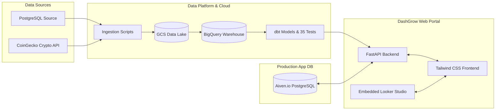

# DASHGROW TECHNOLOGIES - TỔNG HỢP NỘI DUNG & QUYẾT ĐỊNH DỰ ÁN

> **Ngày cập nhật:** 21/08/2026  
> **Dự án:** DashGrow Enterprise Data-as-a-Service Platform (B2B SaaS)  
> **Repository:** `enterprise-data-platform`  
> **Nhánh phát triển:** `feature/automated-testing-and-ci-gates`  

---

## 1. TỔNG QUAN TẦM NHÌN & ĐỊNH VỊ SẢN PHẨM

**DashGrow** là nền tảng phân tích và tăng trưởng dữ liệu B2B SaaS (Data-as-a-Service) dành cho các doanh nghiệp vừa và nhỏ (SMB). Hệ thống kết nối toàn diện từ tầng hạ tầng trích xuất dữ liệu, kho lưu trữ đám mây, mô hình hóa dữ liệu (dbt), kiểm thử chất lượng, đến cổng giao diện Web Portal tích hợp báo cáo BI nhúng (Google Looker Studio).



---

## 2. CÁC QUYẾT ĐỊNH KIẾN TRÚC & KỸ THUẬT QUAN TRỌNG

### 2.1. Phân Quyền Vai Trò & Bảo Mật Dữ Liệu Tuyệt Đối (RBAC & Multi-Tenancy)
- **Quyết định:** Tách biệt 100% không gian làm việc giữa bên Bán (Platform Owner) và bên Mua (SMB Clients).
- **Admin (DashGrow HQ):**
  - **Không bao giờ xem dữ liệu doanh thu / đơn hàng chi tiết của từng shop khách hàng** (bảo đảm quyền riêng tư kinh doanh).
  - Quản trị kinh doanh SaaS: Số lượng Tenants, Doanh thu định kỳ (MRR: ~53.880.000 đ, ARR: ~646.560.000 đ), tỷ lệ gia hạn (98.5%).
  - Quản lý tài khoản: Tạo công ty khách hàng, gán gói cước (Starter / Growth Pro / Enterprise), khóa/mở tài khoản.
  - Quản trị kỹ thuật: Kích hoạt chạy pipeline, theo dõi logs `_pipeline_audit_log`, giám sát 35 bài kiểm thử dữ liệu dbt Data Quality.
  - Quản trị báo cáo: Gán và cập nhật đường dẫn nhúng Google Looker Studio URL cho từng doanh nghiệp.
- **Client (Doanh nghiệp SMB - vd: Olist Retail):**
  - Không gian làm việc riêng tư, chỉ xem báo cáo phân tích kinh doanh của chính doanh nghiệp mình.
  - Tích hợp trực quan qua iframe Google Looker Studio Embed với bộ chọn nhiều báo cáo (P&L, Vận hành tồn kho), hỗ trợ Fullscreen.
  - Tra cứu vòng đời đơn hàng SCD Type 2 (truy vết lịch sử thay đổi trạng thái, phát hiện đơn bị xóa Hard-Deleted).
  - Giám sát độ tin cậy dữ liệu shop (100% Data Integrity, độ trễ đồng bộ < 30s).

---

### 2.2. Cơ Sở Dữ Liệu Quản Trị Hệ Thống (Aiven.io PostgreSQL - `dashgrow_app_db`)
- **Quyết định:** Sử dụng database thật trên cloud **Aiven.io PostgreSQL** để quản lý metadata, người dùng, gói cước và cấu hình Looker URL.
- **Cấu hình kết nối:**
  - **Host:** `pg-1fafec1a-hngphm-bb38.d.aivencloud.com:24878`
  - **Database:** `dashgrow_app_db` | **SSL Mode:** `require`
- **Cấu trúc DDL 5 bảng cốt lõi (Không cần extension, dùng native `gen_random_uuid()`):**
  1. `tenants`: Quản lý hồ sơ công ty/shop khách hàng SMB.
  2. `subscriptions`: Quản lý gói cước SaaS, giá thuê bao, chu kỳ thanh toán.
  3. `users`: Tài khoản người dùng, phân quyền RBAC (`platform_admin`, `client_owner`, `client_viewer`).
  4. `looker_dashboards`: Quản lý danh sách URL nhúng Looker Studio riêng cho từng tenant.
  5. `pipeline_audit_logs`: Nhật ký vận hành ingestion và dbt run.
- **Xử lý cảnh báo Aiven PG Studio:** Xác nhận bằng cách chọn *"Don't ask me again"* và bấm nút **"Run on production"** khi thực thi DDL.

---

### 2.3. Tích Hợp & Khắc Phục Lỗi Nhúng Google Looker Studio
- **Vấn đề phát sinh:** Khi nhúng Looker Studio vào web, Google hiển thị thông báo chặn truy cập đối với tài khoản người xem.
- **Giải pháp & Quyết định:**
  1. **Quyền truy cập nguồn dữ liệu (Data Credentials):** Chuyển từ *"Viewer's Credentials"* sang **"Owner's Credentials"** trong phần quản lý nguồn dữ liệu Looker Studio (Resource ➔ Manage added data sources ➔ Edit).
  2. **Quyền chia sẻ báo cáo (Share Settings):** Đặt Link settings thành **"Public - Anyone on the internet with the link can find and view"**.
  3. **Định dạng link nhúng:** Sử dụng đường link từ menu *File ➔ Embed report* (`https://lookerstudio.google.com/embed/reporting/...`).
  4. **Cơ chế Auto-Normalization:** Hệ thống tự động chuyển đổi các link xem thông thường (`.../reporting/...`) thành link nhúng chuẩn (`.../embed/reporting/...`) cả ở Backend FastAPI và Frontend JavaScript.

---

### 2.4. Thiết Kế Giao Diện UI/UX & Tối Ưu Hiệu Năng
- **Quy chuẩn CSS:** Đồng bộ 100% với thiết kế từ `dashgrow_landing_page.html` (Tailwind CSS, phông chữ `Plus Jakarta Sans`, nền lưới `grid-bg`, bảng màu `#0284c7`, `#0d9488`, `#10b981`, `#0e3a40`).
- **Lược bỏ icon trùng lặp:** Loại bỏ toàn bộ emoji thừa trong thanh điều hướng và tiêu đề bảng; chỉ giữ lại duy nhất 1 icon Lucide SVG thanh mảnh bên trái.
- **Tùy biến Header:** Ẩn avatar cho tài khoản Client, chỉ giữ lại tên người dùng và vai trò; tài khoản Admin hiển thị huy hiệu `HQ`.
- **Toast thông báo:** Thu gọn kích thước, chỉ xuất hiện trong **0.5 giây (500ms)** và tự động mờ dần để không che khuất thao tác.
- **Tối ưu tốc độ truy vấn (Performance Caching):** Áp dụng cơ chế **In-Memory TTL Caching (30s - 60s)** cho các API BigQuery Marts, SCD 2 và Audit Logs, giảm thời gian phản hồi khi chuyển tab xuống **< 2ms**.

---

### 2.5. Quyết Định Cấu Trúc Codebase: Monorepo vs Multi-repo
- **Quyết định:** Giữ nguyên cấu trúc **Monorepo** (`src/web` nằm chung với `src/extractors` và `dbt/`).
- **Lý do:**
  - Sản phẩm là gói giải pháp dữ liệu đầu-cuối (End-to-End Data Product).
  - Dễ dàng kiểm thử tích hợp toàn trình (từ cào dữ liệu đến hiển thị trên Web API).
  - Tối ưu chi phí và quản trị: 1 pipeline CI/CD GitHub Actions duy nhất, 1 bộ cấu hình `.env` tập trung.

---

## 3. DANH SÁCH FILE & THÀNH PHẦN ĐÃ HOÀN THIỆN

| Đường dẫn file | Mô tả vai trò |
| :--- | :--- |
| `src/web/core/config.py` | Cấu hình nạp biến môi trường Aiven PostgreSQL và JWT Authentication. |
| `src/web/core/security.py` | Mã hóa bcrypt và tạo JWT Access Token an toàn. |
| `src/web/db/models.py` | Khai báo 5 SQLAlchemy Models tương thích Aiven PostgreSQL (`Tenant`, `Subscription`, `User`, `LookerDashboard`, `PipelineAuditLog`). |
| `src/web/db/session.py` | Quản lý Connection Pool Aiven và auto-seed tài khoản mặc định. |
| `src/web/api/v1/auth.py` | API Đăng nhập, đăng ký và xác thực phiên người dùng. |
| `src/web/api/v1/users.py` | API Quản trị Khách hàng, Doanh nghiệp và gói cước (Admin Only). |
| `src/web/api/v1/looker.py` | API Cấp phát, quản lý và chuẩn hóa link nhúng Looker Studio theo từng Tenant. |
| `src/web/api/v1/explorer.py` | API Tra cứu SCD Type 2, Audit logs và Data Quality tests. |
| `src/web/services/analytics_service.py` | Xử lý số liệu BigQuery Marts với bộ nhớ đệm In-Memory TTL Cache. |
| `src/web/services/pipeline_service.py` | Xử lý kích hoạt pipeline ngầm và tra cứu lịch sử vận hành. |
| `src/web/static/index.html` | Giao diện Portal phân quyền Admin / Client, bento cards, iframe Looker nhúng. |
| `src/web/static/style.css` | Hệ thống styling Tailwind, grid background và toast animation nhẹ 0.5s. |
| `src/web/static/app.js` | Điều hướng tab, xác thực JWT, quản lý CRUD người dùng và render báo cáo. |

---

## 4. HƯỚNG DẪN VẬN HÀNH & KIỂM THỬ

### 4.1. Lệnh khởi chạy Web Portal
Chạy lệnh sau tại thư mục gốc:
```powershell
python -m uvicorn src.web.app:app --port 8000 --reload
```

### 4.2. Thông tin đăng nhập mặc định (Lưu trên Aiven DB)
- **Tài khoản Admin (DashGrow HQ):**
  - **Email:** `admin@dashgrow.io`
  - **Mật khẩu:** `admin123`
- **Tài khoản Khách hàng (Olist Retail):**
  - **Email:** `owner@olist-store.vn`
  - **Mật khẩu:** `client123`

---
*Tài liệu được tạo tự động để lưu trữ toàn bộ lịch sử thiết kế, quyết định kiến trúc và hướng dẫn vận hành của dự án DashGrow.*
