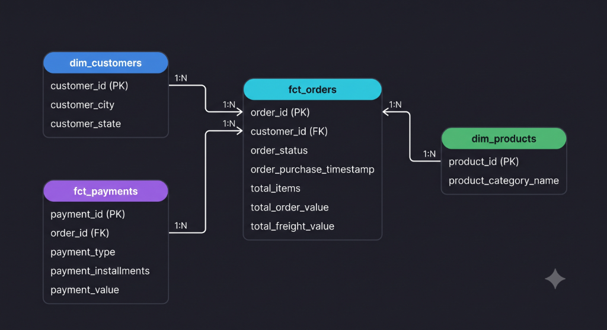
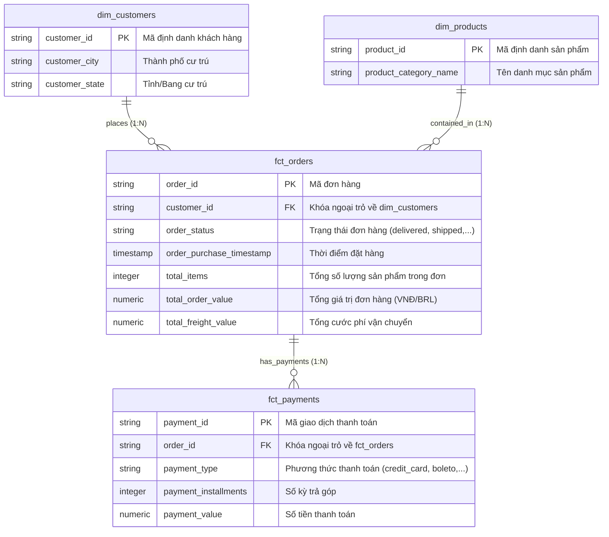

# 🌟 Mô Hình Dữ Liệu OLAP Star Schema (Data Marts)

Tài liệu này mô tả chi tiết sơ đồ kiến trúc **Mô hình hình Sao (Star Schema)** trong BigQuery dataset `marts`. Đây là mô hình chuẩn OLAP được tối ưu hóa cho truy vấn phân tích dữ liệu đa chiều trên **Looker Studio / Power BI**.

---

## 📐 Sơ Đồ Quan Hệ Bảng OLAP (Entity-Relationship Diagram)

---

## 🔍 Diễn Giải Chi Tiết Các Tầng Bảng OLAP

### 1. Bảng Sự Kiện Trung Tâm (Fact Tables)
*Chứa các chỉ số định lượng (Metrics/Measures) phục vụ cộng tổng, tính trung bình và thống kê.*

- **`marts.fct_orders` (Bảng sự kiện Đơn hàng):**
  - **Vai trò:** Trung tâm phân tích doanh số và hiệu năng xử lý đơn hàng.
  - **Chỉ số đo lường (Measures):** `total_items`, `total_order_value`, `total_freight_value`.
  - **Chiều thời gian (Time Dimension):** `order_purchase_timestamp`.

- **`marts.fct_payments` (Bảng sự kiện Thanh toán):**
  - **Vai trò:** Phân tích luồng tiền và hành vi thanh toán của người tiêu dùng.
  - **Chỉ số đo lường (Measures):** `payment_value`, `payment_installments`.

---

### 2. Bảng Chiều Mô Tả (Dimension Tables)
*Chứa các thuộc tính định tính (Attributes/Context) dùng để cắt lát (Slicing) và dicing dữ liệu.*

- **`marts.dim_customers` (Chiều Khách hàng):**
  - **Vai trò:** Cắt lát doanh số theo vị trí địa lý (`customer_state`, `customer_city`).

- **`marts.dim_products` (Chiều Sản phẩm):**
  - **Vai trò:** Cắt lát doanh số theo danh mục mặt hàng (`product_category_name`).

---

## 🚀 Ứng Dụng Trên Looker Studio / Power BI

1. **Drill-down Địa lý:** Kết nối `fct_orders.customer_id ➔ dim_customers.customer_id` để vẽ bản đồ phân bố doanh thu theo Tỉnh/Thành.
2. **Phân tích Doanh số:** Đếm số đơn `COUNT(order_id)` và tổng thu `SUM(total_order_value)` theo các khoảng thời gian trên `order_purchase_timestamp`.
3. **Phân tích Phương thức Thanh toán:** Tỷ trọng `payment_type` dựa trên `SUM(payment_value)`.
