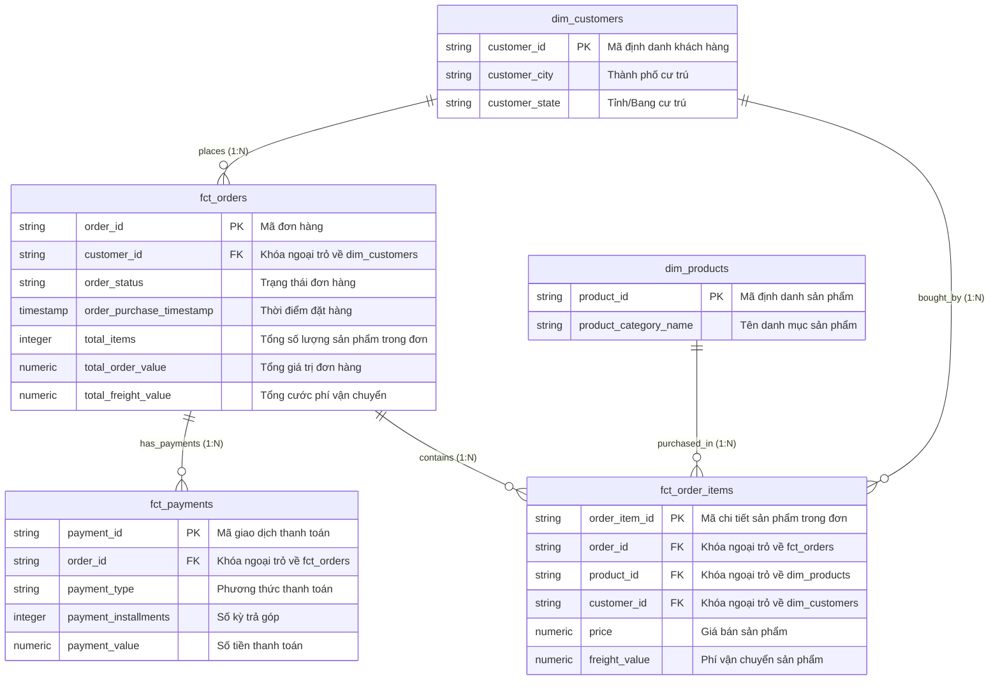

# 🌟 Mô Hình Dữ Liệu OLAP Star Schema (Data Marts)

Tài liệu này mô tả chi tiết sơ đồ kiến trúc **Mô hình hình Sao (Star Schema)** nằm trọn vẹn trong BigQuery dataset `marts`. 

---

## 📐 Sơ Đồ Quan Hệ Bảng OLAP (Entity-Relationship Diagram)

---

## 🔍 Diễn Giải Các Tầng Bảng Trong Schema `marts`

### 1. Bảng Sự Kiện (Fact Tables)

- **`marts.fct_orders` (Fact Đơn hàng - Cấp Header):**
  - **Mức độ chi tiết:** 1 dòng = 1 đơn hàng (`order_id`).
  - **Dùng cho:** Đếm tổng số đơn (`COUNT`), doanh thu toàn sàn (`SUM(total_order_value)`), AOV.

- **`marts.fct_order_items` (Fact Chi tiết Mặt hàng - Cấp Item):**
  - **Mức độ chi tiết:** 1 dòng = 1 mặt hàng bán out (`order_item_id`).
  - **Dùng cho:** Phân tích doanh số theo sản phẩm (`product_id` ➔ `dim_products`), tính sản lượng bán ra.

- **`marts.fct_payments` (Fact Thanh toán):**
  - **Mức độ chi tiết:** 1 dòng = 1 giao dịch thanh toán (`payment_id`).
  - **Dùng cho:** Phân tích tỷ trọng phương thức thanh toán (`payment_type`).

---

### 2. Bảng Chiều Mô Tả (Dimension Tables)

- **`marts.dim_customers`:** Chứa vị trí địa lý khách hàng (`customer_id`, `customer_city`, `customer_state`).
- **`marts.dim_products`:** Chứa danh mục sản phẩm (`product_id`, `product_category_name`).

---

## 🚀 Ứng Dụng Nối Bảng Trên Looker Studio / Power BI

Tất cả các bảng báo cáo **CHỈ NẰM TRONG SCHEMA `marts`**:
1. **Phân tích Doanh số Sản phẩm:** Connect `wide_orders_analytics` view (hoặc blend `fct_order_items` với `dim_products` qua `product_id`).
2. **Phân tích Địa lý:** Connect `wide_orders_analytics` view (hoặc blend `fct_orders` với `dim_customers` qua `customer_id`).
3. **Phân tích Thanh toán:** Connect `wide_orders_analytics` view (hoặc blend `fct_orders` với `fct_payments` qua `order_id`).
